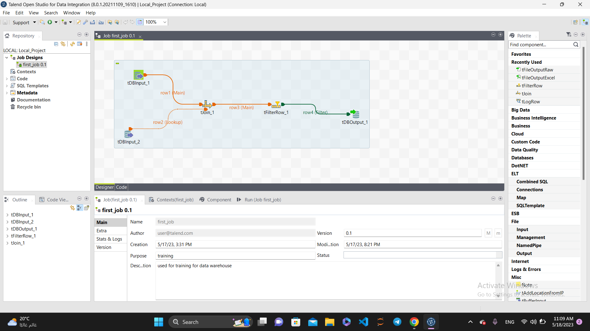
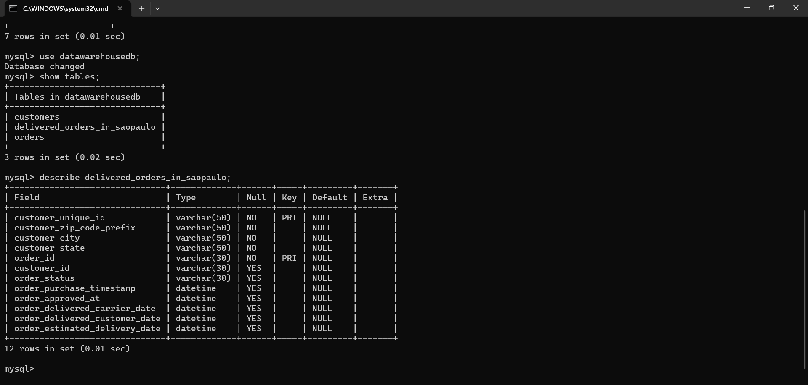

# Olist ETL Pipeline 🔄

> An end-to-end ETL pipeline built with Talend Open Studio and MySQL that extracts customer and order data from the Brazilian Olist e-commerce dataset, joins and filters the data, and loads the results into a data warehouse table.

---

## 📌 Overview

E-commerce platforms generate large volumes of transactional data across multiple tables that need to be consolidated for business analysis. This project builds an ETL pipeline on the Olist Brazilian E-Commerce dataset to demonstrate a complete data engineering workflow, from database design and data loading through extraction, transformation, and warehousing.

The project demonstrates how Talend Open Studio can be used as a visual ETL tool to implement data locality optimization, combining data from relational sources through join operations and business-driven filtering before loading the results into a consolidated data warehouse table.

---

## 🖼️ Project Preview

---

## 🔍 Key Insights

- Joining customers and orders on `customer_id` enables linking geographic customer data with order fulfillment status in a single output table
- Filtering for delivered orders in São Paulo reduces the dataset to the most actionable segment for regional business analysis
- The output table consolidates 12 attributes across customer location and order lifecycle timestamps, enabling end-to-end delivery performance tracking
- Storing results in a dedicated `datawarehousedb` database separates the analytical layer from the operational data sources

---

## ⚙️ Pipeline Design

### Stage 1: Database Setup (MySQL Terminal)
- Created `datawarehousedb` MySQL database
- Defined schema for `customers` table with `customer_unique_id` as primary key and no null values
- Defined schema for `orders` table with `order_id` as primary key and `customer_id` as the shared join key
- Loaded data from CSV files into both tables using MySQL import

### Stage 2: ETL Job (Talend Open Studio)
- **Extract:** Used two `tDBInput` components to read from `customers` and `orders` tables in MySQL
- **Transform:** Applied `tJoin` on `customer_id` to combine both tables, followed by `tFilterRow` to filter for delivered orders in São Paulo
- **Load:** Used `tDBOutput` to write the final result into the `delivered_orders_in_saopaulo` table in `datawarehousedb`

---

## 🛠️ Tools and Techniques

| Tool | Usage |
|------|-------|
| **Talend Open Studio (TOS)** | ETL job design, transformation, and data loading |
| **MySQL** | Database creation, schema definition, and data storage |

---

## 📂 Dataset

This project uses the **Brazilian E-Commerce Public Dataset by Olist** from Kaggle.

🔗 [View Dataset on Kaggle](https://www.kaggle.com/datasets/olistbr/brazilian-ecommerce)
